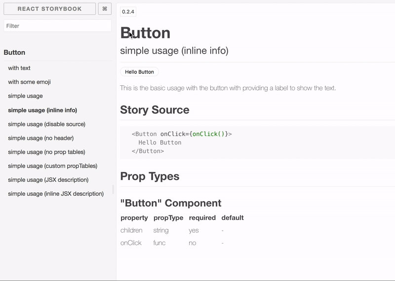

# storybook-addon-versions

This addon allows you to navigate different versions of your components, if you have a setup that produces a different static Storybook build for each of your versions. As such, if you build a static Storybook and host it in, say, the following directory structure:
```
- static-storybook
|-- 0.0.1
|-- 0.0.2
|-- 0.1.2
|-- 0.2.5
```

the addon will allow you to navigate the various versions via the `Versions` panel:



## Configuration

The addon attempts to get a list of available style guide versions from the root of your host. If they are found it will show a dropdown which then lets you navigate to the various versions, as such allowing users to see how a component may have changed over different versions.

The versions are expected to be in a configuration file `storybook-config.json` at the root of your host. You can also mock this in local dev by adding a `storybook-config.json` in your local `.storybook/` folder. Here's some sample content:

```
{
  "storybook": {
    "versions": {
      "availableVersions": [
        "0.0.1",
        "0.0.2",
        "0.1.2",
        "0.2.5"
      ],
      "hostname": "localhost:8000",
      "localhost": "localhost:9001",
      "regex": "\/([^\/]+?)\/?$"
    }
  }
}
```

The options are: 

- `availableVersions`: An array of available versions.
- `hostname`: The hostname of where the static builds are. For now you need to add the path if you are expecting links to 
work in a local dev build but *not* in your normal hosted config.
- `localhost`: Where the local dev build is, when running in dev mode
- `regex`: This is for a regular expression that will extract the version number for your URL. This is dependant on the way you store the static storybook builds. The example above will work for the format `http://localhost:port/<version>/` so for example, version `0.1.2` would be expected to be found like this `http://mystorybook/0.1.2/`.

The config format is the same as for [blabbr](https://github.com/buildit/storybook-addon-blabbr).

